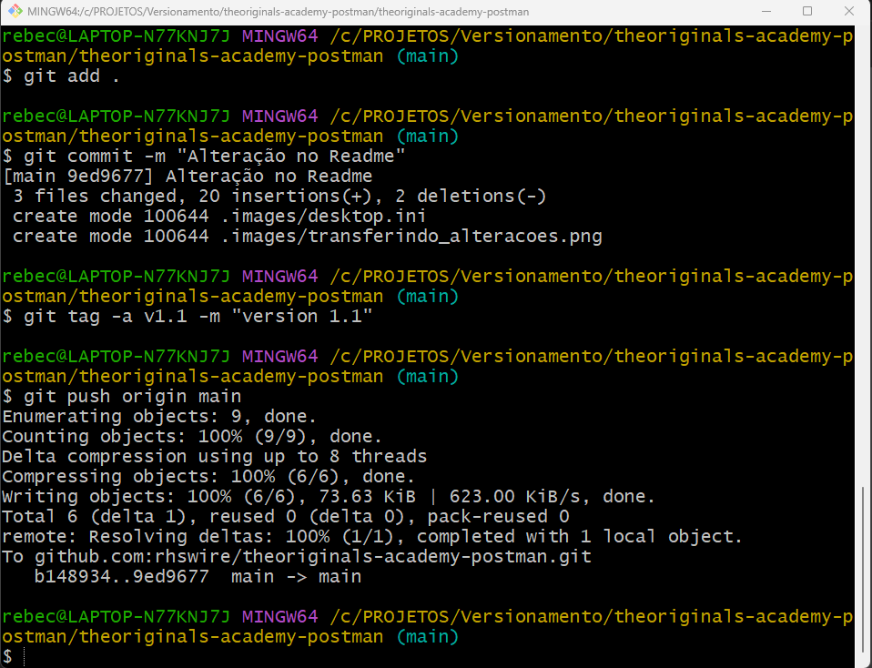

# The Originals Automation Postman


### Projeto de automação com Postman e Report com Newman

Projeto de automação com Postman.

## Instalação
```bash
    npm install -g newman
    npm install -g newman-reporter-htmlextra
```

## Execução com report html extra
```bash
    newman run signup.json -e env-automacao.json -g env-global.json
```

## Git e GitHub

No Git e GitHub, realize as seguintes etapas:

1. Instale e Configure uma conta no Git. Para saber mais, [acesse o Git](https://git-scm.com/download/win).

2. Verifique se tem uma Chave SSH cadastrada, para que você possa conectar o seu repositório local com o repositório remoto. Para saber mais, [acesse o conteúdo do GitHub](https://docs.github.com/pt/authentication/connecting-to-github-with-ssh)

### **Verificando se existe a Chave SSH** 
 
 Abra o Git Bash e digite:

 ```sh default
 ls -al ~/.ssh
 ```
 <p align="center">
  

3. Transferindo as alterações efetuadas no repositório local para o repositório Git.

Dentro do repositório local, abra o Git Bash e digite:

```sh default
 git add .
 ```

 ```sh default
 git commit -m "nome do que está sendo incluído ou alterado"
 ```

  ```sh default
 git tag -a vx.x -m "version x.x"
 ```

  ```sh default
 git push origin main
 ```

<p align="center">
  

## Projeto Desenvolvido por: 
| [<br/><sub>Danielle Sousa</sub>](https://github.com/rhswire)<br/>[](https://www.linkedin.com/in/daniellesousadads/) | [<br/><sub>Karine Bueno</sub>](https://github.com/karinebueno)<br/>[](https://www.linkedin.com/in/karinebueno-quality-assurance-tester/) | [<br/><sub>Raquel Swire Guimarães</sub>](https://github.com/rhswire)<br/>[](https://www.linkedin.com/in/rhswire) | [<br/><sub>Rebeca Swire</sub>](https://github.com/BekaSwire)<br/>[](https://www.linkedin.com/in/rebeca-swire/) | [<br/><sub>Thalita Lisboa</sub>](https://github.com/ThalitaLisboa)<br/>[](https://www.linkedin.com/in/thalita-lisboa/)
| :----------------------------------------------------------: | :----------------------------------------------------------: | :----------------------------------------------------------: | :----------------------------------------------------------: | :----------------------------------------------------------: |